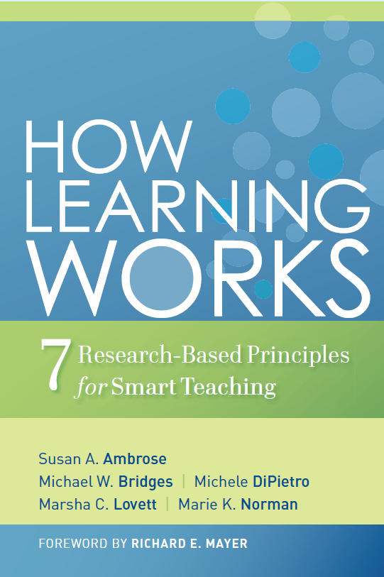
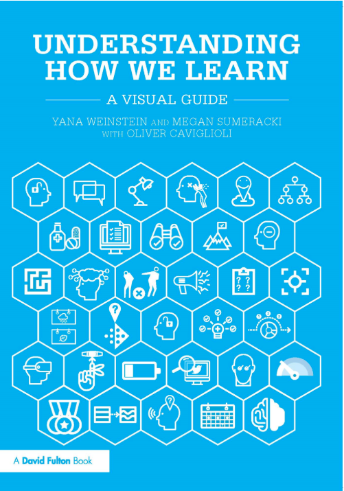
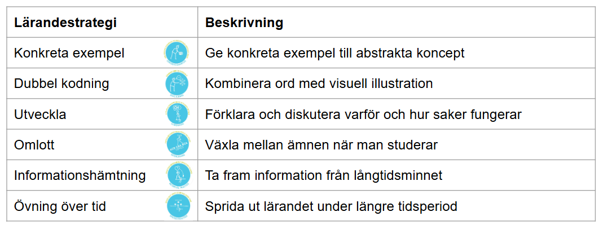
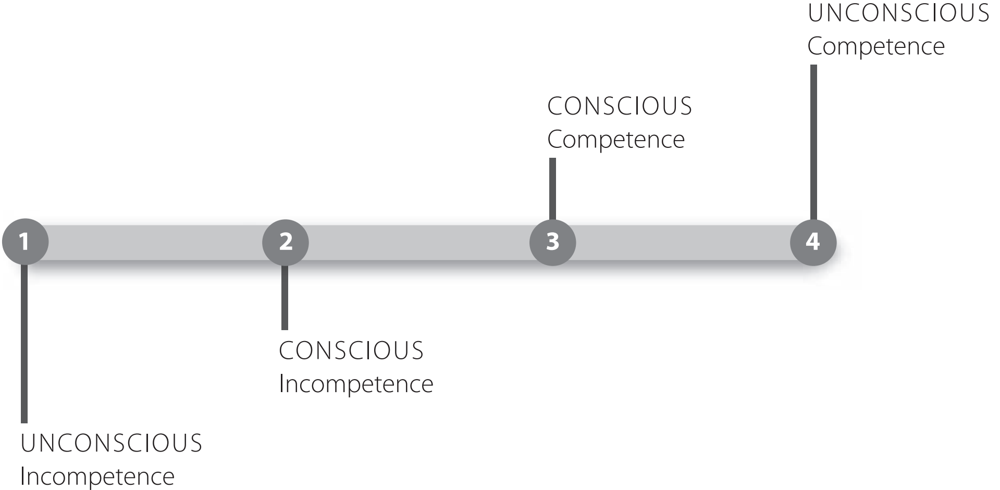
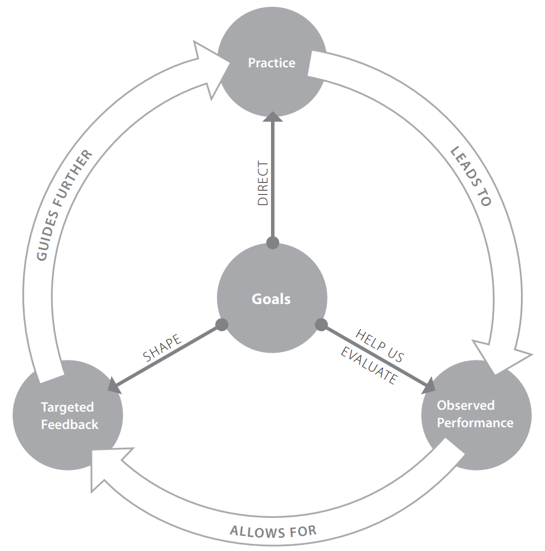
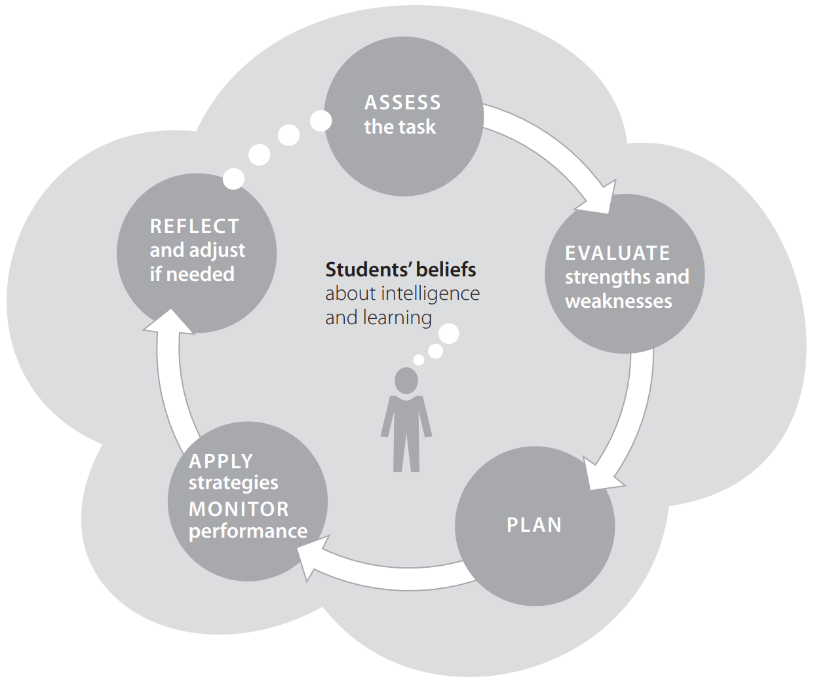

# Pedagogik och ramverk {background-color="#880088" footer="false"}

 

::: {#logo}
{width="25%"}
:::

 

Kursledarprogram WCS 2025

## Hur lär man sig?

Pedaogogiska principer som stöd för hur vi planerar en kurs

## Verktyg

En tydlig struktur, stor eller liten, som hjälper oss att planera och hålla en kurs

## Vad är lärande?

Lärande är en process där vi förändras genom våra erfarenheter.

3 viktiga delar:

-   Lärande är en process, inte en produkt
-   Lärande handlar om att vi förändrar vad vi vet, tror, gör och hur vi tänker
-   Lärande är inget man kan ge någon – det är något varje deltagare gör själv

## Hur fungerar lärande?

Det korta svaret: Ingen vet exakt hur det fungerar

Flera olika modeller:

{width="20%"} {width="20%"}

## Understanding how we learn

## Understanding how we learn

 

#### Konkreta exempel

Följarinitierad styling: Ge ett exempel där ni visar följaren som initierar styling

## Understanding how we learn

 

#### Dubbel kodning

Visa ankarsteget samtidigt som ni ljudar "ank-ar-steg"

## Understanding how we learn

 

#### Utveckla

Varför gör vi en fördröjd viktförflyttning? Den hjälper oss bibehålla connection

## Understanding how we learn

 

#### Omlott

Växla mellan 2 saker

## Understanding how we learn

 

#### Informationshämtning

Be deltagarna demonstrera en whip

## Understanding how we learn

 

#### Övning över tid

Repetera turer och principer under flera lektioner

## How learning works: 7 principer för lärande

 

---

### 1. Deltagarens tidigare erfarenheter påverkar nytt lärande

 

Det du redan kan och tror dig veta påverkar hur lätt eller svårt det blir att lära något nytt.

* Deltagare lär sig bättre när de kan koppla den nya kunskapen till kunskap de redan har.

* Krävs att kunskapen de har är korrekt.

* Exempel: Om en deltagare kan whip och free spin kan den kunskapen användas för att förklara en reversed whip.

---

### 2. Hur kunskap hänger ihop spelar roll

 

Om du förstår hur olika delar hänger ihop blir det lättare att minnas och använda kunskapen i nya situationer.

* Kunskap kan organiseras utefter flera olika grupperingar. Deltagare som har en bra struktur för att organisera sin kunskap lär sig bättre.

* Exempel: Organisera turer i pushes, passes och whips. Eller beroende på sida följaren passerar.

---

### 3. Motivation styr lärandet

 

Ju mer intresserad och engagerad en deltagare är, desto mer energi lägger de på att lära sig – och desto bättre går det.

Om kursen inte känns intressant eller användbar, blir det svårare att vilja lära sig innehållet.

 

2 centrala koncept för att förstå motivation: 

1. Hur viktigt målet känns för deltagaren
2. Hur mycket deltagaren tror att de kan lyckas nå målet

---

### 3. Motivation styr lärandet

 

Deltagarens mål behöver inte alltid vara samma som lärarens mål för deltagaren!

1. Prestationsbaserade mål (klara 5 one-foot spins) 
2. Lärande mål (Lära sig förstå materialet) 
3. Känslomässiga mål (Göra en rolig aktivitet) 
4. Sociala mål (träffa nya kompisar)

**Ju fler mål en aktivitet adresserar desto högre motivation har deltagaren**

---

### 3. Motivation styr lärandet

 

* Ett måls subjektiva värde är vad som påverkar motivationen för att uppnå det.

* Deltagare är motiverade av aktiviteter som har ett mål med högt subjektivt värde.

* Deltagare är motiverade av mål där de tror att de har förmågan att lyckas uppnå dem.

* Deltagarens motivation ökar om hen upplever miljön som stödjande.

---

### 3. Motivation styr lärandet

 

Exempel: Skapa övningar som är lagomt utmanade där deltagaren har tidiga möjligheter att lyckas. Aligna innehåll med deltagarens mål.

---

### 4. För att utveckla kunskap måste deltagaren skaffa sig sakkunskap och träna på att integrera dem

 

För att förstå ett ämne på djupet behöver man kunna de olika bitarna, träna på att få dem att funka ihop och veta när man ska använda vad.

---

### 4. För att utveckla kunskap måste deltagaren skaffa sig sakkunskap och träna på att integrera dem

 

::::: columns
::: {.column width="50%"}
* Expert blind spot kan göra det svårare för experten att förstå de olika färdigheter som behövs för en komplex uppgift

* För att lära ut komplexa färdigheter måste man kunna “packa upp” de individuella delarna
:::

::: {.column width="50%"}

:::
:::::

---

### 4. För att utveckla kunskap måste deltagaren skaffa sig sakkunskap och träna på att integrera dem

 

* Om uppgiften är komplex lär sig eleven bättre genom att dela upp uppgiften i dess komponenter, för att sedan sätta dem samman igen

* Hjälper att reducera den kognitiva belastningen

* Överföra kunskapen till nya situationer

Exempel: Träna snurrteknik separat från en left side turn 

---

### 5. Träning med tydliga mål och bra feedback ger bäst resultat

 

Att veta vad man ska träna på, och få feedback som visar hur man kan bli bättre, gör lärandet mer effektivt.

::::: columns
::: {.column width="60%"}
Lärande sker bäst när:

* Deltagarna fokuserar på ett specifikt mål
* Övningarna ligger på lagom utmanande nivå
* Övningarna är av tillräcklig kvantitet och frekvens

:::

::: {.column width="40%"}

:::
:::::

---

### 5. Träning med tydliga mål och bra feedback ger bäst resultat

 

::::: columns
::: {.column width="60%"}
Feedback ges bäst:

* Relativt till deras mål
* Så tidigt som möjligt
* Mer frekvent

:::

::: {.column width="40%"}

:::
:::::

---

### 5. Träning med tydliga mål och bra feedback ger bäst resultat

 

Hur hjälper vi deltagarna på bästa sätt:

- Flera tillfällen till träning
- Bygg upp lärandet steg för steg (Scaffolding)
- Visa deltagarna vad ni inte vill ha
- Sök efter fel som många gör
- Prioritera din feedback
- Balansera positiv och negativ feedback
- (Låt deltagarna ge varandra feedback)

---

### 6. Lärande påverkas av klimatet i gruppen

 

Hur trygg, välkomnad och respekterad man känner sig i gruppen påverkar hur bra man lär sig.

Hur bidrar vi som kursledare till ett bra klimat:

- Skapa en säker miljö
- Var försiktig med steoreotypa kommentarer 
- Sätt grundregler för hur vi interagerar och kommunicerar med varandra
- Använd första dagen på kursen för att sätta klimatet
- Var beredd på känsliga frågor
- Ta itu med ett spänt klimat så fort som möjligt

---

### 7. Självständigt lärande kräver att man reflekterar över sitt sätt att lära

 

::::: columns
::: {.column width="50%"}
För att kunna styra sitt eget lärande behöver man lära sig att tänka på hur man lär sig och kunna ändra strategi vid behov.
:::

::: {.column width="50%"}

:::
:::::

---

### 7. Självständigt lärande kräver att man reflekterar över sitt sätt att lära

 

Hur kan deltagarna lära sig att lära sig?

- Se till att eleven förstår uppgiften
- Be dem sätta upp en plan för sitt lärande
- Ge dem verktyg att utvärdera sig själva
- Aktivitetet som kräver att eleverna reflekterar över sin insats

# Olika ramverk

## Visa, Pröva, Instruera, Öva

* Visuellt, auditivt, kinestetiskt lärande
* Stegvis övning av turer

::: fragment

Exempel:

* **Visa** en Sugar tuck
* Låt deltagarna **Pröva** en Sugar tuck
* **Instruera** mer i detalj
* Låt deltagarna **Öva** Sugar push

:::

## Visa, Pröva, Instruera, Öva
#### *Pedagogisk princip*
 

1\. **Deltagarens tidigare erfarenheter påverkar nytt lärande**  
Du visar en Sugar push där deltagaren känner igen strukturen från en Sugar push och kan använda erfarenheten därifrån

 

2\. **Hur kunskap hänger ihop spelar roll**  
Du visar en tur som deltagaren kan kategorisera och koppla till befintlig kunskap

## Visa, Pröva, Instruera, Öva
#### *Pedagogisk princip*
 

5\. **Träning med tydliga mål och bra feedback ger bäst resultat**  
Deltagarna får omedelbar feedback när de provar. Ta sig från en sida till nästa, rotera i rätt riktning, osv.

## Upplägg av kurstillfällen

-   Repetition av föregående tillfälle
-   Tekniskt koncept
-   Tur som kräver det tekniska konceptet

::: fragment

Exempel:

-   Repetera föregående tillfälles tur: Left side pass
-   Tekniskt koncept: snurrteknik (prep, spotting, korta steg)
-   Tur som kräver det tekniska konceptet: Left side turn
:::

---

## Upplägg av kurstillfällen
#### *Pedagogisk princip*
 
1\. **Deltagarens tidigare erfarenheter påverkar nytt lärande**  
Repetition och återkoppling till tidigare kunskap bygger broar till det nya

 
2\. **Hur kunskap hänger ihop spelar roll**  
Du visar hur en ny tur (Left side turn) bygger på tidigare teknik  (snurrteknik) och turer (Left side pass), vilket hjälper deltagarna att organisera kunskapen

## Upplägg av kurstillfällen
#### *Pedagogisk princip*
 
4\. **För att utveckla kunskap måste deltagaren skaffa sig** sakkunskap och träna på att integrera dem  
Snurrteknik tränas sakkunskap, för att sedan integreras i en tur

 
7\. **Självständigt lärande kräver att man reflekterar över sitt sätt att lära (indirekt)**  
Genom återkommande struktur kan deltagarna börja se mönster och förstå sin egen inlärningsprocess

## Frågor och feedback

* Uppmuntra till frågor
* Förklara varför något är på ett specifikt sätt
* Deltagare lär sig av att fråga

::: fragment

Exempel:

* Efter att ha gått igenom Left side pass och Under arm:  
    *"Nu har följaren passerat på förarens högra, och vänstra sida, vilka alternativ har vi nu kvar? (Sugar push)"*

* Efter att ha gått igenom en whip:  
    *"Hur många tycker steg 4 är svårt? (använd resultatet för att gå igenom det igen)"*

:::

## Frågor och feedback
#### *Pedagogisk princip*
 

3\. **Motivation styr lärandet**  
Deltagarna blir mer engagerade när de förstår *varför* något fungerar och får möjlighet att påverka

 

5\. **Träning med tydliga mål och bra feedback ger bäst resultat**  
Feedback förbättrar lärandet

## Frågor och feedback
#### *Pedagogisk princip*
 

6\. **Lärande påverkas av klimatet i gruppen**  
Att det är tillåtet att fråga och diskutera signalerar trygghet

 

7\. **Självständigt lärande kräver att man reflekterar över sitt sätt att lära**  
När deltagarna ställer frågor och får resonera, utvecklar de förmågan att övervaka och styra sitt eget lärande

## Rotation och placering

High fives för tillhörighet. Förare eller följare kan rotera, det spelar ingen roll även vid ojämnt antal

## Räkning och taktning

## Lärarlett eller ej

* Börja med lärarlett
* Fortsätt med räkning
* Avsluta med att deltagarna själva får starta och välja turer

::: fragment

Exempel:

* Kursledaren räknar in för en Under arm, samt räknar igenom hela turen
* Kursledaren ger föraren alternativet mellan Under arm och Left side pass. Kursledaren räknar in och räknar, föraren bestämmer turen
* Kursledaren räknar in, men föraren bestämmer fritt vilka turer som dansas

:::

## Lärarlett eller ej
#### *Pedagogisk princip*
 
