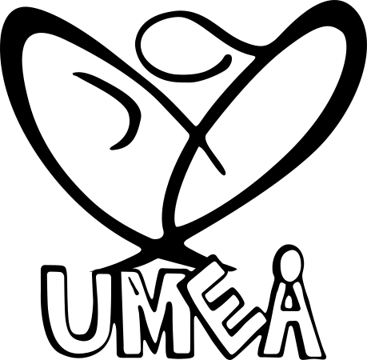

# Pedagogik och ramverk{background-color="#880088" footer=false}

 

::: {#logo}
{width=25%}
:::

 

Kursledarprogram WCS 2025

## Hur lär man sig?

7 pedagogiska principer

## Ramverk

Direkt tillämpbart för undervisning

## Upplägg av kurstillfällen

Pedagogisk princip: 

## Visa, Pröva, Instruera, Öva

Pedagogisk princip:

## Frågor och feedback

Pedagogisk princip: 

## Att inkludera

- Hur fungerar lärande?
- VPIÖ
- Upplägg av kurstillfälle
- Rotationer och placeringar
- 
